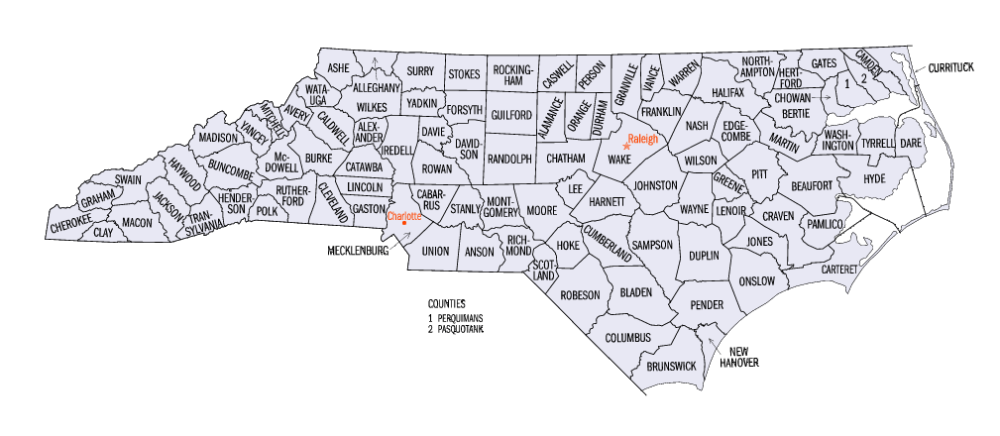

```{r setup, include=FALSE}
knitr::opts_chunk$set(echo = TRUE)
options(digit=3)
source("assets/install.R")
```

# Introduction



The primary motivation of this report is to provide key determinants of crime in the state of North Carolina for

Change police per capita.
Implement tougher arrest protocols.
Enhance community outreach in high density and minority communities.


Increasing government wages will decrease crime rates.
Decreasing tax rates will decrease crime rates.


# Data Loading and Cleaning

We have been provided with a panel dataset for the year *1987* except for *Percent Minority* (pctmin), which is from 1980.

- The *Probability of Conviction* (prbconv) contains *1* observation(s) that are outside the acceptable range for a probability : [0,1]. We may also consider that this variable is mislabled and is indeed not a probability.
- The *Probability of Arrests* (prbarr) contains *10* observation(s) that are outside the acceptable range for a probability : [0,1].

- The *1000 People per Square Mile* (density) contains an anamolous value of 0.0000203422 for Swain County (FIPS=173). According to the U.S. Census Bureau the 1987 population for this county was 10,932; and the total area is 541 sq. miles. Therefore the correct density was 20.207. Looks like there was an arithmatic error which we can easily resolved : 0.0203422.


wikipedia the present population density of this county is 26 people per sq. mile.

We could assume that the data used to calculate these probabalities were inconsistent and possibly not from the same year and or county which has produced this error. Unfortunately this weakens the verasity of these particular variables.

## Transformations

- Experiment with X transformations. Use higher R.Squared and lower MSE as a guide.
- Y tranformations must be applied universally.

# EDA (Model Building Process)


The outcome variable of our study is (crmrte) which is coded as "crimes per person".


```{r}
crime <- read.csv('crime_v2.csv')
crime <- na.omit(crime)
crime <- crime[!duplicated(crime$county),]
crime$prbconv <- as.numeric(as.character(crime$prbconv))
stargazer(crime, type = "html")
```


- What do you want to measure? Make sure you identify variables that will be relevant to the concerns of the political campaign.

- What covariates help you identify a causal effect?

- What covariates are problematic, either due to multicollinearity, or because they will absorb some of a causal effect you want to measure?

- What transformations should you apply to each variable? This is very important because transformations can reveal linearities in the data, make our results relevant, or help us meet model assumptions.

- Are your choices supported by EDA?


Higher Crime Rate Seems to Indicate Higher Police. I.E. the police presence was enhanced in crime ridden counties.


# Regression Models

## Base Model
## Second Model
## Third Model
## Regression Table

# Ommitted Variables

Possible explanatory variables that are not available :
- Level of education.
- Unemployment.
- Private security.
- Sevirity of crimes; misdemeanours vs felonies.
- Type of crimes; drug offenses vs violent crimes, or white collar crimes vs blue collar crimes etc.

# Conclusion

- Does the conclusion address the high-level concerns of a political campaign?
- Is the discussion connected to whether the key effects are real or whether they may be solely an artifact of omitted variable bias?


```{r}
crime <- read.csv('assignment/crime_v2.csv')
```

response <- crime$crmrte
explanatory <- c()

# Test
# Test

```{r mychunk, echo = FALSE, fig.height=3, fig.width=5}

library(knitr)
# sample data
dat <- data.frame(
  text = sapply(1:10, FUN = function(x) { paste0(sample(x = LETTERS, size = 15), collapse = "") }), 
  x1 = rnorm(10), 
  x2 = rnorm(10, mean = 3), 
  x3 = rnorm(10, mean = 5))

# generate plots
invisible(apply(dat[, 2:4], MARGIN = 1, FUN = boxplot))

out <- cbind(row.names(dat), 
             as.character(dat$text), 
             sprintf("", opts_current$get("fig.path"), opts_current$get("label"), 1:nrow(dat)))
kable(out, col.names = c("ID", "Text", "Boxplot"))
```

            X   Y~X  LY~X LY~LX
[1] "  prbarr : 0.16 0.22 0.19"
[1] " prbconv : 0.15 0.20 0.14"
[1] " prbpris : 0.00 0.00 0.00"
[1] "  avgsen : 0.00 0.00 0.00"
[1] "   polpc : 0.03 0.00 0.08"
[1] " density : 0.53 0.40 0.24"
[1] "   taxpc : 0.20 0.13 0.12"
[1] "pctmin80 : 0.03 0.05 0.16"
[1] "    wcon : 0.15 0.16 0.16"
[1] "    wtuc : 0.06 0.04 0.04"
[1] "    wtrd : 0.18 0.16 0.15"
[1] "    wfir : 0.11 0.09 0.08"
[1] "    wser : 0.00 0.01 0.00"
[1] "    wmfg : 0.12 0.09 0.13"
[1] "    wfed : 0.24 0.27 0.25"
[1] "    wsta : 0.04 0.03 0.02"
[1] "    wloc : 0.13 0.08 0.09"
[1] "     mix : 0.02 0.02 0.00"
[1] " pctymle : 0.08 0.08 0.10"
